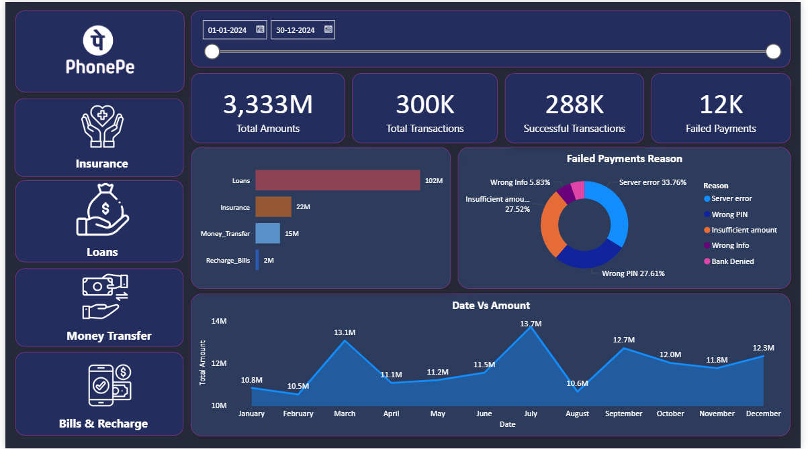
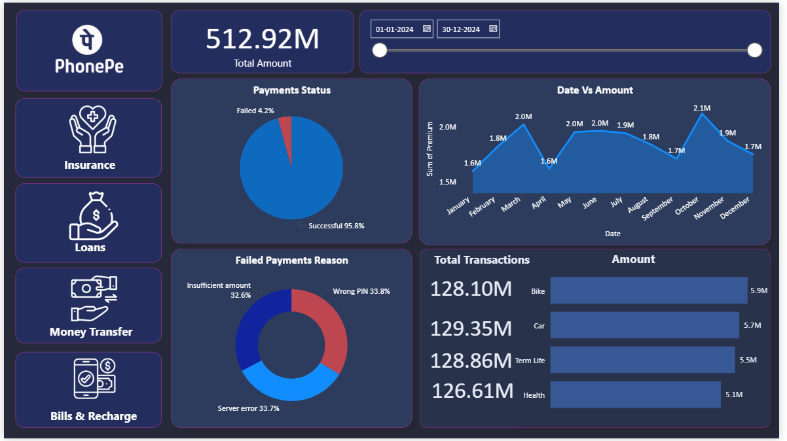
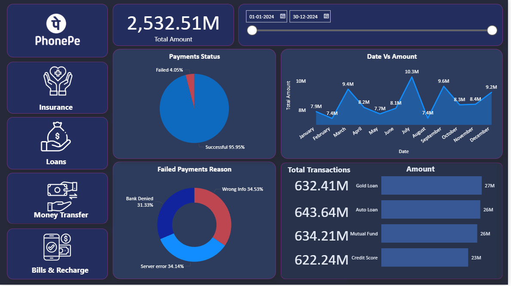

# PhonePe Payment Analytics Dashboard — Power BI


---

## 🔗 Quick Access

| Resource | Link |
|---|---|
| 📊 **Live Dashboard** | [View Power BI Dashboard](#) ← *paste your link here* |
| 📂 **Dataset (Google Drive)** | [Download Dataset](#) ← *paste your link here* |

---

## 🏢 1. Background & Business Context

PhonePe, one of India's largest UPI-based payment platforms, processes hundreds of millions of transactions monthly across insurance, loans, peer-to-peer transfers, and utility bill payments. As the platform scales, a critical operational challenge emerges: **understanding why payments fail — and acting on it before users churn.**

Every failed transaction is a lost user moment. At scale, even a 1% increase in failure rate can translate to millions of rupees in unprocessed value and thousands of users migrating to competing apps.

A data analyst is tasked with building an end-to-end Power BI solution to answer:

- Where are payments failing — and what is causing it?
- Which service vertical carries the most financial risk from failures?
- Are failure patterns consistent across services or isolated to specific verticals?
- What do monthly trends reveal about demand surges and infrastructure gaps?

The resulting dashboard gives business and engineering stakeholders a **single source of truth** — turning raw transaction logs into actionable intelligence across 5 service verticals.

---

## 🗂️ 2. Data Structure

The project is built on **5 service-level tables** linked to a consolidated master transactions table.

| Table | Key Columns | Description |
|---|---|---|
| `All_Transactions` | `date`, `amount`, `status`, `failure_reason` | Master table — union of all service data |
| `Insurance` | `date`, `premium`, `status`, `insurance_type`, `failure_reason` | Premiums across Term Life, Car, Bike, Health |
| `Loans` | `date`, `loan_amount`, `status`, `loan_type`, `failure_reason` | EMI payments — Gold Loan, Auto, Mutual Fund, Credit Score |
| `Money_Transfer` | `date`, `amount`, `status`, `transfer_mode`, `failure_reason` | UPI transfers — UPI ID, QR Code, Mobile Number, Self Account |
| `Recharge_Bills` | `date`, `amount`, `status`, `category`, `failure_reason` | Utility bills — Mobile Recharge, Electricity, DTH, Cable TV |

**Relationships:**
- All service tables share `date` and `status` as common fields with `All_Transactions`
- A single date range slicer on the homepage drives cross-page filtering via these relationships
- DAX measures are applied per-table to isolate successful vs. failed amounts at the visual level

---

## 📌 3. Executive Summary

> **Period:** Jan 2024 – Dec 2024 &nbsp;|&nbsp; **Platform:** PhonePe &nbsp;|&nbsp; **Tool:** Microsoft Power BI Desktop

### Key Metrics — Full Year 2024

| Metric | Value |
|---|---|
| 💰 Total Transaction Amount (Successful only) | ₹3,333M |
| 🔄 Total Transactions | 300K |
| ✅ Successful Transactions | 288K — **96% success rate** |
| ❌ Failed Payments | 12K — **4% failure rate** |
| 🏆 Highest Value Vertical | Loans — ₹2,532M |
| 📉 Most Stable Vertical | Bills & Recharge — ₹4.1M–₹4.4M/month |

### Top 4 Business Insights

> 🔴 **Server errors cause ~34% of all payment failures** — appearing consistently across every service vertical, not just one, signalling a systemic platform infrastructure gap

> 📅 **Transaction volumes peak in March (₹13.1M) and July (₹13.7M)** — seasonal demand surges that require proactive capacity planning to prevent service degradation

> 🏦 **The Loans vertical alone accounts for 76% of total platform transaction value (₹2,532M)** — making it the highest-priority vertical for failure prevention and reliability investment

> 📱 **Bills & Recharge achieves the highest success rate (96.15%)** with the most stable monthly volumes — the most predictable and lowest-risk revenue stream on the platform

---

### 📸 Dashboard Snapshots

**🏠 Homepage — Platform-Wide Transaction Overview**



---

**🛡️ Insurance Page — Premium Payments & Coverage Type Breakdown**



---

**🏦 Loans Page — EMI Payments & Loan Category Analysis**



---

**💸 Money Transfer Page — P2P Transfer Mode Analysis**


---

**📱 Bills & Recharge Page — Utility Payment Trends**


---

## 🔍 4. Insights Deep Dive

### Insight 1 — Server Errors Are a Cross-Platform Reliability Crisis

**Data:**
| Page | Server Error Share of Failures |
|---|---|
| Homepage | 33.76% |
| Loans | 34.14% |
| Insurance | 33.7% |
| Bills & Recharge | 34.4% |
| Money Transfer | 32.7% |

Server errors maintain a near-identical ~34% share of failures **across every service vertical.** This is not a product-specific bug — it is a systemic platform infrastructure issue. Unlike wrong PIN or insufficient balance (user-side failures), server errors are entirely within PhonePe's engineering team's control. At 300K total transactions, resolving even half of server-side failures recovers approximately 2,040 additional successful payments per cycle.

---

### Insight 2 — Wrong PIN Is a UX Problem, Not a User Problem

**Data:** Wrong PIN = 27.61% (Homepage) | 33.8% (Insurance) | 32.8% (Money Transfer) | 33.4% (Bills & Recharge)

Wrong PIN failures rank second across every page — and their consistency across multiple unrelated services points to a **product design friction issue** rather than individual user error. When millions of users repeatedly enter the wrong PIN across different service types, the common variable is the interface. Biometric authentication, contextual PIN hints, or a streamlined recovery flow would directly address this category.

---

### Insight 3 — Loans Represent 76% of Platform Value With Above-Average Failure Risk

**Data:**
| Vertical | Total Amount | Failure Rate |
|---|---|---|
| Loans | ₹2,532.51M | 4.05% |
| Insurance | ₹512.92M | 4.20% |
| Money Transfer | ₹364.82M | 4.02% |
| Bills & Recharge | ₹48.56M | 3.85% |

Loans generate disproportionate platform value but carry a 4.05% failure rate — meaning approximately ₹102M in loan transactions fail annually. A 0.5% improvement in loan payment success recovers more value than eliminating **all failures** in Bills & Recharge entirely. This makes Loan payment reliability the single highest-ROI investment on the platform.

---

### Insight 4 — Money Transfer Usage Is Fully Democratized Across All Four Modes

**Data:** UPI ID = 91.99M | QR Code = 90.98M | Self Account = 91.03M | Mobile Number = 90.82M transactions

All four P2P transfer methods show near-identical transaction volumes — a variance of less than 1.2M across all modes. This signals **mature, diversified user adoption** of the full UPI ecosystem. No single mode dominates, meaning infrastructure investments and failure-resolution efforts benefit all user segments equally regardless of which transfer method they prefer.

---

### Insight 5 — Bills & Recharge Is the Most Operationally Stable Vertical

**Data:** Monthly amounts range from ₹4.1M to ₹4.4M — a variance of just ₹0.3M across all 12 months

While Loans fluctuate by up to ₹2.9M month-over-month, Bills & Recharge maintains near-flat monthly volumes. This low-variance pattern makes it the most **forecastable revenue stream** on the platform and the ideal baseline for infrastructure capacity planning and load-testing assumptions.

---

## 🎯 5. Recommendations

| Priority | Recommendation | Insight Basis | Expected Outcome |
|---|---|---|---|
| 🔴 **Critical** | Invest in server infrastructure resilience — reduce server error share from 34% to under 15% | Server error = #1 failure cause across all 5 verticals | Recovers ~2,000+ failed transactions per cycle; reduces churn risk platform-wide |
| 🟠 **High** | Implement biometric or auto-fill PIN for returning users across all services | Wrong PIN = 28–34% of failures platform-wide | Reduces the second-largest failure category; improves payment conversion |
| 🟠 **High** | Build a loan payment reliability layer — retry logic, multi-bank fallbacks, failure alerts | Loans = 76% of total platform value at 4.05% failure rate | Highest absolute value recovery potential of any single vertical |
| 🟡 **Medium** | Plan infrastructure capacity spikes specifically for March and July | Peak months hit ₹13.1M–₹13.7M vs. ₹10.5M monthly average | Prevents service degradation during highest-demand periods |
| 🟢 **Ongoing** | Add in-app financial guidance nudges for Insurance users before payment submission | Insurance failures evenly split across all three failure types including user-side errors | Reduces preventable failures; improves insurance premium collection rates |

---

## ⚠️ 6. Caveats & Assumptions

- **Synthetic dataset:** All data was AI-generated for portfolio demonstration purposes. It is designed to mirror realistic PhonePe transaction patterns but does not represent actual company data. Real PhonePe data requires NDA-governed internal access.
- **Transaction-level analysis only:** No user-level demographic data (age, geography, device type, income segment) was available. Adding these dimensions would significantly improve segmentation depth and recommendation precision.
- **Money Transfer date gap:** Data for this vertical begins January 14, 2024 — not January 1. This creates a minor undercount in early-month totals for this vertical specifically.
- **"Bank Denied" category scope:** This failure reason appears exclusively on the Loans page. Whether it exists in other service schemas but was not captured — or is genuinely Loans-specific — cannot be confirmed from the current data.
- **Currency denomination:** All amount fields are assumed to be in Indian Rupees (₹) based on the PhonePe platform context. The raw dataset does not include an explicit currency label.
- **Single failure reason per transaction:** Each failed transaction is assigned one failure reason. In practice, transactions may fail due to compounding factors — this nuance is not captured in the current data model.

---

## 🛠️ Tools & Technologies

| Tool | Purpose |
|---|---|
| **Microsoft Power BI Desktop** | Dashboard design, DAX measures, report publishing |
| **Power Query (M Language)** | Data loading, transformation, and table relationships |
| **DAX** | Custom measures — success-filtered totals, failure counts by reason, cross-table aggregations |
| **Excel / CSV** | Source data format for all 5 service tables |

---

## 📁 Repository Structure

```
phonepe-transaction-analytics-powerbi/
│
├── 📊 PhonePe_Dashboard.pbix        ← Main Power BI file
│
├── 📸 Screenshots/
│   ├── Homepage.png
│   ├── Insurance.png
│   ├── Loans.png
│   ├── Money Transfer.png
│   └── Bills and Recharge.png
│
├── 📂 Dataset/                      ← Hosted on Google Drive (see Quick Access above)
│   ├── all_transactions.csv
│   ├── insurance.csv
│   ├── loans.csv
│   ├── money_transfer.csv
│   └── recharge_bills.csv
│
└── 📄 README.md
```

---

## 👤 Connect With Me

If you found this project useful or want to discuss data analytics, feel free to reach out!

> 📬 [LinkedIn](https://www.linkedin.com/in/seema-kumari-375763308/) &nbsp;|&nbsp; 💼 [GitHub Portfolio](https://github.com/seema-kri) &nbsp;|&nbsp;

---

*Built to demonstrate end-to-end Power BI development — from raw transaction data to business-ready insights across a real-world FinTech use case.*
